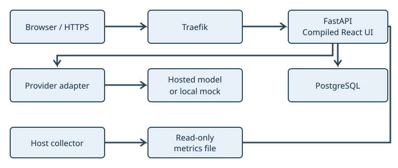

# The whole system: follow a request and its consequences

A user wants a private conversation that remains available tomorrow. That simple expectation connects interface state, identity, durable data, a model integration and operations. We will trace one short synthetic prompt before evaluating any particular framework.

Read this conceptual trace first. To execute it, set up the environment in [the next local chapter](02-local.md), then return for [Lab 02](labs/02-request-trace.md). If HTTP, process, origin or transaction terminology is unfamiliar, use the [foundations bridge](foundations.md). By the end, explain which component owns each decision and what an observed success leaves unproved.

## The components and their jobs

The browser loads a compiled React/TypeScript interface and calls the FastAPI API on the same browser origin. In public deployments, Traefik receives HTTPS and forwards to the app; local Compose exposes the app directly on loopback HTTP. PostgreSQL persists account, conversation and generation state. SQLAlchemy mediates Python/database work. A provider adapter translates an external protocol or supplies deterministic mock output.

Figure 1. HTTPS enters through Traefik. The app persists state in PostgreSQL and calls a provider through its adapter. A separate collector supplies a read-only metrics file; the application does not control Docker.

The diagram shows the public topology. Host metrics are a separate operator-supplied file, not permission for the app to control Docker. Local labs can run without that collector; missing host metrics are distinct from failed database health.

This is a modular monolith: one application deployment with selected internal boundaries. [Routes](../app/main.py) handle HTTP input/authentication and responses; [services](../app/services.py) hold use-case operations; [models](../app/models.py) define mapped durable structures; [adapters](../app/providers.py) handle provider protocols. These are useful responsibilities, not claims that every module is already ideally separated. `create_app` constructs configuration, database factory and adapters, and accepts substitutions for tests.

## Worked trace: “Explain a transaction”

Assume a synthetic ordinary user is approved and signed in. The frontend has an in-memory access token and creates or selects an owned conversation.

| Step | Decision / observation | Owner of the decision |
|---|---|---|
| 1. Send a prompt | POST to `/api/conversations/{id}/stream` with JSON and Authorization. | Browser transport formats a request; it does not grant access. |
| 2. Establish current identity | Decode claims; load current user/session family. | API dependencies reject invalid or revoked sessions. |
| 3. Admit work | Check conversation owner, model policy, duplicate key, concurrency and daily budget. | Use case/database transaction. |
| 4. Commit intent | Persist prompt, empty reply, generation and reservation before model I/O. | Database commit makes admitted work durable. |
| 5. Produce increments | Adapter yields mock/vendor events; API returns SSE frames. | Provider boundary and streaming orchestration. |
| 6. Show and retain result | Browser parses frames and renders text; finalization persists result/state. | UI state plus later database transactions. |

An SSE event is a protocol frame; a network chunk is merely bytes delivered together. Fetch may receive one frame in pieces or several frames in one chunk. The [streaming chapter](05-streaming.md) investigates why a parser must buffer and decode incrementally.

The mock replies with `Workshop reply:` followed by the prompt, subject to its output bound. That makes a local journey deterministic. It does not prove a real provider accepts the same payload or reports complete usage. Adapters now normalize typed text, usage and terminal events; unexplained EOF fails while preserving partial output. Read the [provider code tour](generated/code-tours.md) and [terminal regression tests](../tests/integration/test_terminal_state.py) to distinguish that specific contract from guarantees about every external service.

## A failure belongs to a boundary

If an unrelated account sends the same conversation ID, `owned` rejects it before model work. If the daily reservation would exceed a limit, admission rejects the request instead of opening a paid stream. If a provider fails after some text, finalization and the UI need to communicate the resulting state; output already shown cannot be treated as if the request never began.

Observe status, event sequence and saved history before assigning blame to “the frontend” or “the server.” A visible reply does not establish database persistence; a saved message does not establish that a screen showed completion; health 200 does not establish either. Lab 02 connects those observations into one trace.

## How to judge the architecture

In 1972, David Parnas compared decompositions of a keyword-in-context indexing
system. Organizing modules around likely-to-change design decisions offered a
different boundary from organizing them around processing steps. This is a
historical argument for information hiding, not a prescription to split every
step into a service. In our case, vendor request/event details can change without
rewriting daily-budget policy; both remain in one deployment. Compare the
original example with this boundary rather than treating “modular” as a label
that proves maintainability. [Parnas, original publication and transcription
caveat](references.md#ref-parnas).

Provider adapters isolate vendor payloads from budget policy. HTTP input schemas differ from mapped database objects. SQLAlchemy already supplies unit-of-work behavior. Adding a generic repository or another service requires a demonstrated change/reliability benefit, not a desire to name another pattern. The [people and ideas chapter](13-engineering-ideas.md) connects those choices to information hiding, substitution and responsibility.

Twelve-factor guidance asks whether config is external, durable state survives worker replacement, dependencies are declared and release identity is traceable. [The architectural chapter](15-architecture-and-twelve-factors.md) and [canonical evidence mapping](../docs/requirements.md) distinguish intent from proof. The app has durable state and bounded resources; replica scaling, crash behavior and QA promotion still need further evidence.

**Checkpoint:** propose a second deployment of the same artifact. Identify the configuration, database/volume, secrets, proxy routes and cost/resource boundaries that must differ. Then compare that proposal with [the actual environment runbook](../docs/environments.md). Explain which shared-host failure remains even after data and credentials are separate.
