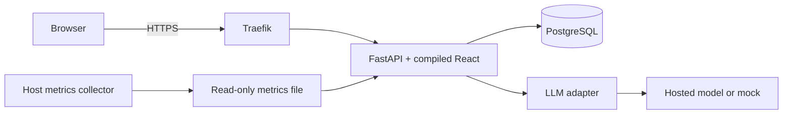

# 1 · Follow one request

The browser loads a static React bundle and calls a same-origin FastAPI API. Traefik terminates HTTPS. The app authenticates a JWT, checks the current database session and user, then invokes a use case. SQLAlchemy writes durable state to PostgreSQL. A provider adapter emits text; the API sends it as server-sent events.

This is a modular monolith, not a microservice demonstration. [Routes](../app/main.py) own HTTP concerns; [services](../app/services.py) own use cases; [models](../app/models.py) own durable structure; [adapters](../app/providers.py) own vendor protocols. Dependency injection happens in `create_app`.

SOLID is visible in change boundaries: a provider can change without changing conversation policies; HTTP schemas differ from ORM models; the admin UI cannot replace server-side authorization. SQLAlchemy already provides a unit of work, so another generic repository wrapper would add vocabulary without useful behavior.

Twelve-factor ideas have practical consequences: lock dependencies; configure runtime secrets; build once; store state outside workers; log to stdout; bind a port; run migrations/admin tasks separately. [The full mapping](../docs/requirements.md) provides the checklist. Do not confuse a checklist with evidence that operations work.

**Exercise:** identify the image, database, configuration and proxy changes required to add a second deployment of the same commit.
