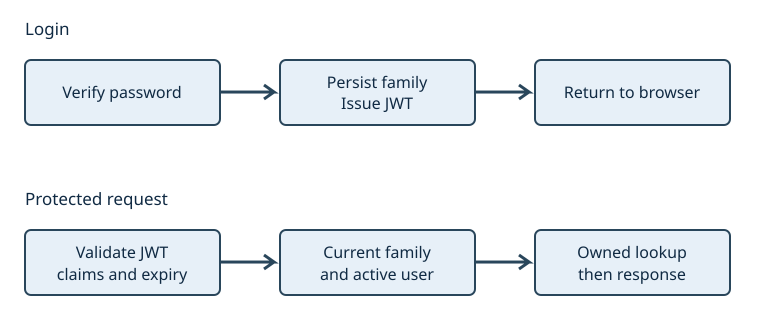

# Identity and roles: permission is a current decision

Alice and Bob both have accounts. Alice starts a private conversation. Bob discovers its identifier. A signed token can establish Bob's identity; it cannot establish that Bob owns Alice's conversation. This distinction is the central question of the chapter.

After reading, you should be able to trace login/refresh/logout as state transitions, distinguish readable signed claims from random bearer secrets, predict the API's ownership/role decisions, and compare this design with a simpler server session. Use [Lab 01](labs/01-token-boundaries.md) for token validation and [Lab 04](labs/04-ownership.md) for account boundaries.

## Four questions rather than one “secure” flag

| Question | Actual responsibility | Example failure |
|---|---|---|
| Who is making the request? | Password verification or validated access claims. | Invalid/expired token receives 401. |
| Is this account/session still allowed? | `current` checks database user and session-family state. | Revoked family or disabled account receives 401. |
| May this actor use this resource? | `owned` checks conversation ownership. | Bob receives 404 for Alice's conversation. |
| May this actor perform this administrative action? | `admin` checks the current database role. | An ordinary user receives 403. |

The browser communicates available actions, but the API owns these decisions. Hiding an admin button improves the interface; it does not stop a direct HTTP request. Conversely, possessing a valid user token does not confer administrator rights.

## The choices behind the design

The [session history](12-history.md#from-server-sessions-to-signed-access-tokens) compares opaque server sessions with signed access tokens. This app uses a hybrid: short-lived JWT access claims plus database-backed session families and rotating opaque refresh tokens. It has deliberately not eliminated the database from authentication.

In [security.py](../app/security.py), passwords use Argon2id through `PasswordHasher`; random refresh/recovery secrets use SHA-256 digests. Human-selected passwords can be guessed from a small candidate set, so password verification uses an expensive password-specific algorithm. The library documents its [Argon2id default and parameters](https://argon2-cffi.readthedocs.io/en/stable/api.html). Refresh secrets come from `secrets.token_urlsafe(48)`; storing their digests avoids storing the bearer value needed to use them. These different inputs justify different hashing choices.

The app signs JWTs using HS256. Their payload is readable; the signature establishes integrity/authenticity under the signing key, not confidentiality. Do not place secrets inside them. JWT is a broader standard that also supports encrypted forms; this application's tokens use the signed form. [RFC 7519](https://www.rfc-editor.org/rfc/rfc7519) defines the format and registered claims.

| Claim emitted here | Meaning in this app | Validation/use |
|---|---|---|
| `sub` | User identifier. | Required; loads current user. |
| `sid` | Session-family identifier. | Required; loads family and checks that it belongs to `sub`. |
| `iss` | Configured application origin. | Must equal configured issuer. |
| `aud` | `373-chat`. | Must match this audience. |
| `iat` / `exp` | Issued-at / ten-minute expiry by default. | Required; decoder validates time claims. |

`decode_token` fixes the permitted algorithm, issuer and audience from server configuration. It does not trust a token to choose its own validation policy. The JWT contains no role claim in this implementation; roles come from the current user row. Read the [generated code tour](generated/code-tours.md) beside the complete [security helpers](../app/security.py).

## Worked lifecycle: login, rotate, revoke

Assume synthetic Alice is active, approved and eligible under the email policy. A correct password creates a `Family` with a seven-day expiry by default and a `Refresh` row containing a digest. The transaction commits before the server returns the access token and sets the refresh cookie.

Figure 2. Login verifies a password, commits a session family and refresh-token digest, and returns access claims plus an HttpOnly cookie. Each later request validates claims, reads the current family/user, then checks ownership. The rotation table below explains the next cookie exchange and its failure states.

`current` decodes the JWT and reads both rows. It rejects missing, expired or revoked families, a family belonging to a different subject, and missing/inactive/unapproved/unverified users. Subsequent authenticated requests consult current state even if the access token has not yet expired. This supports revocation but creates a database availability/latency dependency.

In `rotate`, PostgreSQL locks the family and refreshes the token row before deciding whether it was used. The old token becomes used and a new digest is committed. Presenting a consumed token revokes the family. This is a conservative replay response: reuse can result from theft, a replayed request or an uncoordinated client, so the symptom alone does not prove an attacker.

| Event | Database effect | Next expected observation |
|---|---|---|
| Valid refresh | Old token used; replacement digest saved. | New cookie/access token; old refresh value is no longer usable. |
| Reuse old refresh value | Family revoked. | HTTP 401; even the new access token fails current-family checks. |
| Logout | Cookie's family revoked, cookie deleted. | A token from that family fails subsequent current checks. |
| Password change | Correct current password required; new hash and all-family revocation committed. | Existing access sessions fail; new login required. |
| Administrative revoke | User's families revoked; active generations flagged for cancellation. | New auth requests fail; streaming cancellation is cooperative. |

The frontend [refresh helper](../frontend/src/api.ts) shares one in-flight refresh promise **within one tab**. Separate tabs have separate JavaScript memory but can share the refresh cookie. Cross-tab rotation/logout coordination remains [issue #10](https://github.com/kaw393939/is373-ai-chat/issues/10). Do not infer browser-wide safety from within-tab serialization. A late refresh response or two tabs rotating one cookie is an explicit review problem.

## Browser storage and request boundaries

Access tokens stay in tab memory. The refresh cookie is HttpOnly, `SameSite=Strict`, scoped to `/api/auth`, and Secure when `APP_ENV=production`. Local development uses HTTP and therefore cannot demonstrate the Secure-cookie property. Reloading uses refresh to restore access rather than retrieving a token from localStorage.

HttpOnly prevents JavaScript from reading that cookie. It does not prevent malicious script from issuing actions through an already authenticated browser. Safe rendering, restrictive browser policy and server authorization still matter. Refresh and logout require an Origin matching configured `BASE_URL`; login checks it when supplied. Same-origin deployment avoids a cross-origin CORS configuration, but that topology is not a substitute for these checks.

## Enrollment, ownership and administrative limits

Default registration creates an ordinary account awaiting approval. With delivery disabled in local labs, registration does not prove inbox control. When enabled, new users also verify their address. Approval grants access; verification demonstrates address control. [Migration 0002](03-data.md#migration-0002) preserves old accounts' verification policy rather than retroactively verifying their inboxes.

`owned` returns 404 for both missing and unrelated conversations. It locks/loads the row and compares its owner with authenticated user ID; callers do not use an owner supplied in the request body. Returning a common result limits this lookup's disclosure of whether another user's identifier exists. It is not a guarantee that all possible side channels are absent.

Administrator routes check current role. A user cannot acquire that role through registration. User editing refuses changes to the editing administrator's own account, revokes the edited user's sessions and records an audit event. This protects that one self-edit path; a complete concurrent last-administrator invariant remains [issue #14](https://github.com/kaw393939/is373-ai-chat/issues/14), and administrator MFA remains [issue #6](https://github.com/kaw393939/is373-ai-chat/issues/6).

Recovery/verification links have thirty-minute expiry and stored digests. Their consumption locks the user and invalidates sibling links for the same purpose. Browser links carry the token in a URL fragment, keeping it out of ordinary request URLs; the frontend later submits it to the relevant API. Delivery, encryption and retry semantics belong in [email](11-email.md), and real sending activation requires separate proof.

## Observe failures and evaluate alternatives

Run Lab 01's synthetic expiry experiment and Lab 04's two-account scenario in a disposable local environment. The [account tests](../tests/integration/test_accounts.py) demonstrate refresh/reuse and revocation expectations; [chat tests](../tests/integration/test_chat.py) cover cross-account reads/deletes; [web-security tests](../tests/integration/test_web_security.py) exercise unauthorized writes and administrative methods. Tests clear application data: use dedicated test targets only.

A server-session cookie design could keep identity state behind an opaque identifier and avoid issuing JWT access claims. Our hybrid permits a distinct bearer-access boundary but pays for rotation, replay handling and coordination while still consulting durable state. For a small same-origin application, simplicity is a serious argument for the alternative. The JWT requirement determines this case's chosen exercise, not a universal recommendation.

Submit a request/state trace, sanitized status evidence and one counterexample to “a signature is sufficient.” Then propose how to prove cross-tab correctness or compare session alternatives using explicit criteria. A passing happy-path login is only one part of that argument.
