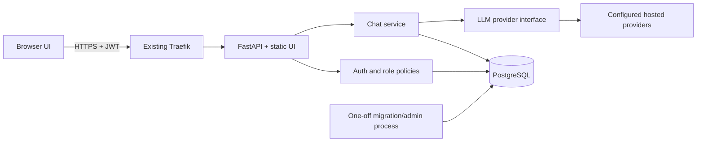

# Historical architecture proposal

**Status: initial design discussion, retained as historical context. This is not the current implementation specification.** The app subsequently selected React/TypeScript, direct HTTP provider adapters, PostgreSQL/async SQLAlchemy and a modular monolith. Consult the [working-system chapter](../book/01-system.md), [book](../book/README.md), [implementation evidence](implementation-evidence.md) and [environment runbook](environments.md) for implemented behavior and remaining limits. LiteLLM, separate module names and additional capabilities below were options, not assertions that they shipped.

The following text preserves the initial proposal. Exact installed versions now come from dependency locks; older project versions are not authoritative.

## Application structure

Start with a modular monolith: FastAPI HTTP routes, application services, domain policies, and infrastructure adapters. This keeps deployment manageable and makes responsibilities visible without adding distributed services.

Suggested modules: `auth`, `users`, `chat`, `providers`, `admin`, `audit`, `config`, and `db`. HTTP schemas remain separate from ORM models. Use dependency injection at the composition root. Application services depend on narrow interfaces for provider access, mail, and storage. SQLAlchemy handles the database unit of work; add repositories only where they express useful domain queries, avoiding generic wrappers around every ORM operation.

Use PostgreSQL locally, in integration tests, and in production. Use async SQLAlchemy with an async driver; one session per task and bounded connection pools. Persist the prompt and close its transaction before waiting on the LLM. Persist completion or failure through a separate short transaction; do not hold a database connection throughout a long stream. Alembic revisions are reviewed code. Autogeneration cannot reliably infer all changes, including renames. Run schema drift checks and test both fresh installation and upgrades. Sources: [SQLAlchemy async sessions](https://docs.sqlalchemy.org/en/20/orm/extensions/asyncio.html), [Alembic autogeneration](https://alembic.sqlalchemy.org/en/latest/autogenerate.html).

Initial entities: users, roles/user-role assignments, refresh sessions, email verification/password reset tokens, conversations, messages, generation runs, model configurations, usage records, and audit events. Message and run state should distinguish pending, streaming, complete, cancelled, and failed. Conversation ownership is checked server-side on every relevant operation.

## Authentication and administration

Use Argon2 password hashing and short-lived signed JWT access tokens. Validate signature with an algorithm allowlist, issuer, audience, expiration, and subject. Keep browser access tokens in memory. Use an opaque random refresh token in a Secure, HttpOnly cookie with explicit SameSite policy; store only its hash server-side, rotate it, and detect reuse. JWT authentication does not require refresh tokens to be JWTs. Reloading the page obtains a new access token through the refresh session. Add CSRF/Origin checks for cookie-authenticated endpoints, restrictive CORS when needed, and same-origin deployment by default.

Roles start with user and admin. Authorize each API operation and each owned object, rather than trusting UI controls or stale role claims. Resolve sensitive administrative privileges against current database state; disabling an account/revoking sessions must take effect without waiting for a long JWT expiry. Users cannot select their roles during registration. Bootstrap the first admin through a one-off command, with no default password or public admin signup.

Full account scope includes registration, email verification, login, logout, session management, password change/reset, account disablement, and rate limiting. Generic account-recovery responses avoid leaking which emails exist. Design rate limits for multiple processes; use shared PostgreSQL-backed counters initially or add Redis when warranted. Do not introduce Redis merely for an unused cache.

Admin console: user search/status, role assignment, session revocation, model availability, per-user usage and budget controls, and auditable administrative changes. Provider keys stay out of browser responses and ordinary admin listings. Conversation visibility for administrators requires a deliberate privacy policy; default to metadata rather than unrestricted transcript access.

Sources: [FastAPI JWT and password hashing](https://fastapi.tiangolo.com/tutorial/security/oauth2-jwt/), [OWASP storage guidance](https://cheatsheetseries.owasp.org/cheatsheets/HTML5_Security_Cheat_Sheet.html), [OWASP authorization](https://cheatsheetseries.owasp.org/cheatsheets/Authorization_Cheat_Sheet.html).

## Streaming chat and provider independence

Use an authenticated POST with `fetch`, an Authorization header, and a streamed `text/event-stream` response. Parse SSE framing across arbitrary network chunks; chunks are not necessarily complete events or UTF-8 characters. Native EventSource is convenient for GET subscription streams but does not supply this POST/header interface. Fetch streams support this request design. Sources: [SSE](https://developer.mozilla.org/en-US/docs/Web/API/Server-sent_events/Using_server-sent_events), [Readable streams](https://developer.mozilla.org/en-US/docs/Web/API/Streams_API/Using_readable_streams).

Define provider-neutral events such as `started`, `delta`, `usage`, `completed`, and `error`, with stable request/run IDs. Support AbortController cancellation, provider cancellation where available, heartbeats, bounded buffers, timeout handling, and persisted interrupted state. Use idempotency keys to prevent duplicate paid generations. Retry only when safe; do not silently restart a stream after text was delivered. A separate cancellation endpoint can address races where browser disconnection alone is insufficient.

Create an `LLMProvider` interface and adapter registry selected from validated configuration. Normalize content, usage, errors, and finish reasons. Keep a capability matrix for streaming, tools, structured output, multimodal input, and context limits. Unsupported capabilities must be explicit. A provider-independent app cannot promise identical behavior or costs across models.

Evaluate LiteLLM SDK inside one adapter for broad coverage, or direct provider SDK adapters for a smaller dependency surface. Keep LiteLLM types out of the domain and HTTP contract so it can be replaced. The mock provider is deterministic and requires no paid keys for CI. Keep actual provider credentials on the server and choose initial providers before credential setup. Sources: [LiteLLM providers](https://docs.litellm.ai/docs/providers), [async streaming](https://docs.litellm.ai/docs/completion/stream).

Core chat scope: conversation history, rename/delete/search, model selection, streaming Markdown/code display, stop/retry/regenerate, and usage limits. Sanitize rendered Markdown; treat model output as untrusted. Define partial-response persistence and retention policy. Attachments, RAG, tools, sharing, voice, and billing are later milestones requiring their own acceptance criteria.

## Frontend discussion

| Choice | Project fit | Tradeoff |
|---|---|---|
| React + TypeScript + Vite | Recommended when continuity with the existing React course and admin UI component reuse matter | Build tools and state management require discipline |
| Svelte + TypeScript | Strong alternative for a compact reactive chat and admin UI | Adds a different framework to the course |
| Native ES modules + Web Components | Strong when teaching browser standards is the priority; Lit is an optional small component layer | More responsibility for routing, forms, state, accessibility, and component conventions |
| WebAssembly frontend | Consider for a specific computational feature or explicit Rust/C# learning goal | Adds a language/toolchain and browser integration work without a demonstrated chat bottleneck |

These fit assessments are engineering judgments. [React](https://react.dev/learn), [Svelte](https://svelte.dev/docs/svelte/overview), [Lit](https://lit.dev/docs/), and [WebAssembly concepts](https://developer.mozilla.org/en-US/docs/WebAssembly/Guides/Concepts) explain their respective models.

A static UI can be built in a Docker build stage and served by FastAPI initially. This supports a single-origin API and avoids another runtime on the small droplet. If SSR/SEO later becomes a requirement, evaluate a separate frontend runtime. Stream/render performance should be measured before introducing WebAssembly. JWT security is independent of the UI framework.
