# Installation and CI/CD plan

This is the sequence the finished guide and automation must implement. Commands, scripts, Dockerfiles, and application workflows are pending. No production deployment is enabled by this repository yet.

## Two installation paths

1. **Fresh DigitalOcean droplet:** choose an adequately sized supported Ubuntu LTS host; SSH keys and a dedicated operator; OS patches; DigitalOcean cloud firewall plus host firewall; Docker official repository and Compose; DNS; a single Traefik stack; persistent certificate storage; monitoring; and backups. Provisioning may be manual in the first lab, with infrastructure-as-code considered separately.
2. **Existing classroom host:** inspect running services with authorized privileged access, reuse `/opt/webserver` and network `web`, create a separate app directory/project and database volume, add a unique router, and leave the existing calculator available. Do not repeat fresh-server proxy setup.

For both paths, verify DNS, TLS, port exposure, health, and a restart after reboot. Confirm IPv6 records/firewall behavior if IPv6 is used. Expose only required proxy/SSH ports; PostgreSQL must not publish a public host port. Restrict SSH at the cloud firewall when feasible. Docker port publishing can bypass some UFW expectations; inspect actual bindings. Sources: [Docker Ubuntu installation](https://docs.docker.com/engine/install/ubuntu/), [DigitalOcean cloud firewalls](https://docs.digitalocean.com/products/networking/firewalls/).

## Intended local workflow

The finished repository will include `.env.example`, `.dockerignore`, a locked backend environment, a locked frontend build when relevant, a multistage Dockerfile, base Compose, and explicit development/production overlays. Local setup copies `.env.example` to ignored `.env`, generates local secrets, starts PostgreSQL, runs Alembic, and starts the API/UI. A mock LLM mode lets students exercise chat before configuring a paid provider.

Production pulls a tested image by digest, with no source bind mounts or development reload. Use non-root application containers, dropped capabilities, a read-only root where compatible, bounded temporary storage, health checks, resource/log limits, restart policies, and persistent database storage. Apply [Compose production configuration](https://docs.docker.com/compose/how-tos/production/).

## Configuration and secret ownership

| Setting | Location | Notes |
|---|---|---|
| APP_ENV, APP_HOST, JWT_ISSUER, JWT_AUDIENCE, allowed origins | Environment configuration | Validate at startup; no baked production values |
| DATABASE_URL / database credentials | Ignored local .env; protected host configuration | Separate development, test, staging, production |
| JWT signing key | Local generated key; protected production secret | Document rotation and key IDs; never image build arguments |
| Provider API keys | Local .env for development; protected host secrets | Server-side only; never frontend build variables |
| DEPLOY_SSH_KEY | GitHub production environment secret | Dedicated key, not an operator's personal SSH private key |
| DEPLOY_KNOWN_HOSTS | GitHub protected configuration | Independently verify host fingerprint; do not blindly trust live ssh-keyscan |
| DEPLOY_HOST, DEPLOY_USER, DEPLOY_PATH, APP_URL | GitHub environment variables | Non-secret deployment coordinates |
| GITHUB_TOKEN | Automatically issued to Actions jobs | GHCR publishing with narrowly scoped packages:write |
| GHCR read credential | Host only, if images are private | Separate least-privilege credential; workflow token is short-lived |
| DOCKER_API_KEY | Alternative Actions secret if Docker Hub chosen | Existing repo secret does not automatically transfer to this repo |
| SMTP/API mail credential | Host runtime secret | Needed for verification/reset messages |
| Backup destination credential | Backup process secret | Separate from application/provider credentials |

A local .env is developer convenience; the production process consumes validated environment/configuration without depending on a source checkout. `.env` must be excluded from Git and Docker build context. Docker Compose file secrets provide explicit service access but are not a general encrypted secret vault. Support `_FILE` settings if using mounted secrets and document this alongside twelve-factor configuration. See [Compose secret handling](https://docs.docker.com/compose/how-tos/use-secrets/).

Default proposal: provision runtime secrets on the server once, with restricted permissions, so routine CI deployment needs only deployment access. If secret delivery from GitHub is selected, store individual environment secrets and transfer them through a protected channel without logging them. Do not store a whole production .env blob as one secret. Existing secrets cannot be copied by reading their values through GitHub APIs.

## Intended GitHub Actions release sequence

```mermaid
flowchart LR
    PR[Pull request] --> Checks[Lint + types + unit/API + migrations]
    Checks --> Image[Build release image once]
    Image --> Browser[Container browser + streaming + auth tests]
    Browser --> Scan[Image scan + SBOM evidence]
    Scan --> Publish[Main: publish tested artifact to registry]
    Publish --> Deploy[Serialized deploy: digest + configuration]
    Deploy --> Migrate[Run Alembic once]
    Migrate --> Start[Start application + readiness]
    Start --> Verify[Public HTTPS + commit + login/stream smoke]
```

Use GitHub-hosted runners, SHA-pinned actions, read-only default permissions, isolated pull request checks without production credentials, and deployment concurrency that does not cancel an in-progress migration. Do not execute untrusted PR code with privileged triggers. Proposal: GHCR avoids a separate publishing token; Docker Hub remains valid for course continuity. Verify plan support for private repository environment protections before configuring them. Sources: [Actions secure use](https://docs.github.com/en/actions/reference/security/secure-use), [deployment environments](https://docs.github.com/en/actions/reference/workflows-and-actions/deployments-and-environments), [GHCR](https://docs.github.com/en/packages/working-with-a-github-packages-registry/working-with-the-container-registry).

Test at least linux/amd64 for this server; add native arm64 testing if multi-platform releases are a teaching requirement. Never publish an untested architecture as if verified. Use mock provider fixtures for CI; real-provider smoke tests are opt-in with limits. Tests must cover registration/login, refresh rotation/reuse, roles, conversation isolation, stream parsing/cancellation/error handling, and database upgrades.

Use the exact tested image artifact for publication; identify the release by Git commit and registry digest. Publish before deployment, then deploy that digest, not an unqualified moving tag. Include release configuration and schema compatibility metadata. Keep image scanning thresholds explicit; a green report-only scan does not mean a clean image.

Dedicated deployment access needs a documented bootstrap step. Adding a user to the docker group effectively grants host administrative power. Prefer a narrowly controlled deployment wrapper when practical; otherwise clearly document the authority of a dedicated operator account. No self-hosted Actions runner on the public production droplet by default.

## Database deployment and recovery

Only one deployment/migration process may operate at a time; serialize workflow and host operations, including manual runs. Snapshot/backup as needed before a risky migration. Run `alembic upgrade head` from the selected release image as a one-off process. Never run migrations independently in every web worker. Failed migrations stop promotion; examine schema state before retrying.

Use expand/contract migrations so both the previous and new app versions can run against the upgraded schema. A failed application readiness check can restore the previous digest only if schema compatibility permits. Destructive schema downgrade is not an automatic rollback strategy. Document recovery choices, including point-in-time restore where the database service supports it.

Single-container replacement can interrupt service and streams. Do not claim zero downtime. Blue/green routing and graceful stream draining are optional later work and require additional memory and compatibility tests.

Back up PostgreSQL to storage outside the droplet, encrypt/protect backup access, define retention and recovery objectives, and test a restoration. DigitalOcean droplet backups complement database-specific backups rather than establishing tested database recovery by themselves. Monitor memory, disk, uptime, readiness, failures, and request/LLM usage; avoid logging JWTs, keys, passwords, or full prompts by default. Sources: [DigitalOcean backups](https://docs.digitalocean.com/products/backups/details/features/), [Monitoring](https://docs.digitalocean.com/products/monitoring/).

## Completion evidence

The finished install guide must be followed on a clean environment. Record installation commands and verified results; Actions URL, commit, image digest, Alembic revision, public TLS/release result, browser smoke result, and successful backup restoration. A pushed image and successful workflow alone do not prove a healthy deployed app.
