# Install, verify and promote

The source implements a build-once pipeline with dev/QA acceptance and explicit production promotion. Installation and CI evidence are separate: check the dated [implementation evidence](implementation-evidence.md) and [environment evidence](environments.md) before claiming the new workflow is active on a host. The first formal version is 2.0.0; the earlier 1.0.0 implementation was untagged. [ADR 0001](decisions/0001-environments-and-releases.md) owns the supported contracts/version decision.

## Choose the host installation path

For a fresh DigitalOcean droplet, follow [observed-host recreation](recreate-observed-host.md): supported Ubuntu, key-based operator access, OS maintenance, cloud/host firewall, Docker's official repository, DNS, one Traefik ingress and protected certificate storage. Its historical audit is not proof of a clean independent installation; record that rehearsal separately. On the existing classroom host, reuse `/opt/webserver` and external Docker network `web`; each chat environment owns its own directory/project/database. Inspect existing routers and preserve unrelated applications.

Verify the DNS → verified TLS → router → app → database path. Expose required SSH/HTTP/HTTPS ports; never publish production PostgreSQL or the app's internal port. Inspect actual Docker bindings because published ports can bypass some UFW assumptions. Verify IPv6 records/firewall rules if used, health after a reboot, memory/disk and recovery access. Primary sources: [Docker Ubuntu installation](https://docs.docker.com/engine/install/ubuntu/), [DigitalOcean cloud firewalls](https://docs.digitalocean.com/products/networking/firewalls/).

Local installation remains the [README quick start](../README.md#start-locally). Copy the ignored `.env` example, start its loopback database, build, migrate, seed, prompt for an admin password and start the app. Mock chat requires no paid credential. Locally built images have the OCI version label `unreleased` unless a matching `APP_VERSION` is supplied; CI release builds supply the authoritative [`VERSION`](../VERSION). The privileged wrapper accepts only validated release metadata.

## Bootstrap fixed host access

Run [operator bootstrap](../deploy/README.md) from a reviewed source commit. Install root-owned files before enabling the new workflow:

| Repository file | Installed path |
|---|---|
| `deploy/chat-deploy` | `/usr/local/sbin/chat-deploy` |
| `deploy/chat-ssh` | `/usr/local/lib/chat-ssh` |
| `deploy/release_policy.py` | `/usr/local/lib/chat-release-policy.py` |
| `deploy/host-metrics.py` | `/usr/local/lib/chat-host-metrics.py` |
| `deploy/backup_status.py` | `/usr/local/lib/backup_status.py` (sanitized backup freshness input) |

The wrapper fixes the registry namespace and roots `/opt/is373-ai-chat-dev`, `/opt/is373-ai-chat-qa`, `/opt/is373-ai-chat`. Each protected `.env` is mode 0600 with independent JWT/database secrets; never clone production secrets or data into previews. Public preview security uses `APP_ENV=production`, while preview Compose explicitly forces mock LLM, disabled email, empty provider keys and bounded resources. Host state/lock lives in root-owned mode-0700 `/var/lib/chat-release`.

Generate three dedicated Ed25519 deployment keypairs locally inside ignored mode-0700 `.state/deploy-keys`. Keep each private key off the host. Install only its public half in the operator's `authorized_keys` with `restrict,command="/usr/local/lib/chat-ssh dev"`, `qa`, or `production`. Preserve personal operator access. Verify the server's host fingerprint independently, store it privately and retain strict SSH checking. The validated sudoers entry allows the root-owned deployer; the forced command/parser limits what each CI key may request. Docker access itself is host administrative power, so file ownership and the wrapper are part of the boundary.

| Key scope | Accepted command | Fixed effect |
|---|---|---|
| dev | `deploy dev DIGEST SHA VERSION` | Development root only |
| qa | `deploy qa DIGEST SHA VERSION` | QA root only |
| qa | `attest DIGEST SHA VERSION RUN_ID` | Root-owned acceptance record after the QA job succeeds |
| production | `promote DIGEST SHA VERSION QA_RUN_ID` | Same current accepted QA artifact after completed successful main CI |

No scope accepts an arbitrary command, filesystem path or image repository. The short-lived Actions token arrives on SSH stdin, supplies registry read/API evidence access and stays in a temporary Docker auth directory. It is not persisted in the release record. Never print full Compose/Docker inspection output: runtime secrets are present there.

## GitHub configuration

Use public-repository environments `development`, `qa`, `production` with deployment branches restricted to main. October 6 configuration sets production's required owner reviewer, disabled administrator bypass and allowed self-review because this is a sole-owner project. This is authenticated review, not independent two-person approval. Manual dispatch selects a candidate; environment approval authorizes the deployment. Keep immutable GitHub releases enabled; `/immutable-releases` reports `enabled=true`. Repository admins can change protections, so administrative access remains trusted.

| Configuration | Environment | Ownership |
|---|---|---|
| `DEPLOY_SSH_KEY` | Each of development/qa/production | Its distinct scoped private key |
| `DEPLOY_KNOWN_HOSTS` | Each | Independently verified server host key |
| `DEPLOY_HOST` variable | Each | Approved host address; user/path/repository are fixed in code |
| `QA_SMOKE_EMAIL`, `QA_SMOKE_PASSWORD` | qa | Approved active ordinary synthetic account (`role=user`) |
| `GITHUB_TOKEN` | Automatically issued per job | Minimal contents/packages/actions permissions declared in workflows |
| Database/JWT/provider/mail settings | Protected host `.env` | Runtime configuration, separate from deployment credentials |

Provision the ordinary QA account through registration and administrator approval before enabling acceptance. Give it only synthetic data; do not use an administrator for the CI browser probe. Plan administrator MFA enrollment for the 2.0.0 login contract before enforcing the production policy. Install metric/backup timers independently and verify their output; starting the app does not establish monitoring or recoverability. Follow [encrypted backup/off-host retrieval](operations/backups.md), including the collector's `backup_status.py` companion. No new paid storage/host is required by the chosen topology.

Sources: [GitHub environments and protection availability](https://docs.github.com/en/actions/how-tos/deploy/configure-and-manage-deployments/manage-environments), [Actions secure use](https://docs.github.com/en/actions/reference/security/secure-use), [GHCR](https://docs.github.com/en/packages/working-with-a-github-packages-registry/working-with-the-container-registry), [immutable releases](https://docs.github.com/en/code-security/concepts/supply-chain-security/immutable-releases).

## Delivery and production selection

```mermaid
flowchart LR
    PR[PR: read-only verification] --> Checks[Lint / tests / migration parity]
    Checks --> Image[Build image once with VERSION + commit]
    Image --> Browser[Isolated image browser tests]
    Browser --> Scan[Scan + SBOM]
    Scan --> Faults[Two-replica process faults]
    Faults --> Publish[Main only: publish saved image]
    Publish --> Dev[Deploy digest to development]
    Dev --> QA[Deploy / migrate / browser / smoke QA]
    QA --> Accept[Root-owned QA attestation]
    Accept --> Select[Authenticated manual selection + production approval]
    Select --> Prod[Promote same digest]
    Prod --> Release[Immutable tag / release / durable evidence]
```

[Delivery](../.github/workflows/delivery.yml) builds/tests linux/amd64, runs isolated browser and two-process fault experiments on that image, saves it, then publishes the saved artifact. PRs have no deployment credentials. Manual delivery runs verify without publishing. Main's successful verification publishes, deploys development, then deploys QA and tests verified HTTPS, version/commit/schema, ordinary login, mock streaming, persistence after reload, refresh and logout. The probe creates and removes only its synthetic conversation; it cannot target production, register users, change roles or invoke paid providers/mail. The destructive classroom browser suite retains its separate loopback/nonce guard.

Failed migration, browser or smoke checks prevent an accepted candidate. A later attestation job independently checks GitHub's completed QA job and the current host release/health. [Promotion](../.github/workflows/promote.yml) accepts only a successful main delivery run ID, downloads its candidate and evidence, and checks its commit/workflow/job result and unused version. The server rechecks the completed run and private current QA attestation. A newer QA deployment invalidates an older selection. Both workflows share non-cancelling release concurrency; the root-owned host lock covers all release operations too.

Select a candidate using GitHub Actions → **Promote accepted QA release**, main branch, accepted delivery run ID. Review/approve its production environment. Promotion pulls the exact accepted digest, without rebuilding, then verifies public production commit/version/schema. Its immutable GitHub Release attaches QA/production records, SBOM, vulnerability report, coverage and atomic commit links. A tag or version already used is refused; changing RC metadata to stable requires another build and QA acceptance. Never force-move a released tag. CI artifacts expire; the release's attached evidence remains the archive.

## Database deployment and recovery

Under the shared host lock, the deployer stages Compose from the selected image, validates required variables/configuration, starts/waits for its own PostgreSQL, records schema and creates a private nonempty custom-format dump. The dump streams into protected staging and is fsynced/renamed after success, avoiding memory proportional to database size. Only then does it replace active Compose, run `alembic upgrade head` once, seed defaults, start/wait for the app, compare health identity and atomically record success. Every setup step is inside recovery handling. The backup is mode 0600; failed/empty backup creation stops promotion. Daily/off-host backup recovery is a separate operation from this pre-migration dump.

Use expand/contract migrations and review compatibility before deployment. Automatic old-image recovery occurs only when schema is unchanged, or before migration started. Changed/unknown schemas stop the app and record `blocked`; an operator chooses a reviewed forward fix or restores the pre-migration dump into a controlled replacement database. No automatic downgrade occurs. Restoring loses writes after the dump unless separately recovered: declare the recovery point and retain evidence. A single app replacement can interrupt service/streams; zero downtime is not claimed.

Uvicorn has a ten-second graceful shutdown deadline and production/preview Compose gives it a 20-second stop margin. The [two-process experiment](../tests/process/README.md) tests SIGTERM partial finalization, actual 150-second KILL lease reclamation and mail accepted-before-commit restart using synthetic receipts. Abrupt loss may lose emitted text not yet finalized. A working database is needed for graceful cleanup, and later admission reclaims expired leases lazily. Exact-image CI and observed timings are required before treating these settings as measured recovery guarantees.

| Private host record | Meaning |
|---|---|
| `release.json` | Active deployed/blocked identity, version, commit, image, schema/previous schema, backup and recovery boundary |
| `current-image` | Last successfully selected image; inspect release status before treating it as healthy |
| `last-attempt.json` | Sanitized failure phase, before/after schema and recovery result |
| QA `qa-attestation.json` | Accepted artifact, schema and successful QA run |
| Production `version-history.json` | Versions previously deployed; deleting a Git tag does not authorize reuse |

Failed recovery cannot report the candidate as deployed. Failed release publication *after successful production deployment* is a different boundary: inspect the matching production record and finalize the matching immutable release/evidence explicitly. Do not delete history, rerun migrations under the same version or reuse that version for different bytes. A new application fix receives its own version/candidate. Local fault-injection tests cover setup, empty backup, changed schema, failed recovery and release/key policy; controlled non-production rehearsal and full CI are required operational evidence.

## Completion evidence

Record the Actions URL, source commit, VERSION, image digest, before/after Alembic revisions, private backup identity, verified HTTPS, QA/browser results, production approval and archived GitHub Release. Separately verify cross-environment rejection, resource behavior and a successful backup restore/off-host retrieval. No production failure injection or paid-provider testing belongs in these probes. Link actual evidence to [#13](https://github.com/kaw393939/is373-ai-chat/issues/13), [#22](https://github.com/kaw393939/is373-ai-chat/issues/22), [#24](https://github.com/kaw393939/is373-ai-chat/issues/24), [#25](https://github.com/kaw393939/is373-ai-chat/issues/25) before closing them.

## Dependency maintenance decision — October 6, 2026

Official registry metadata resolved Node `24-alpine` to `sha256:ebfe2f90462722a7a4de65e91990e97fe0d401c70e0e762c5b53302f905ec1c1`, matching the new Dockerfile pin. Python and PostgreSQL already used immutable digests; CI's PostgreSQL service now shares that pin. The mutable `apt-get upgrade` step was removed: OS fixes arrive through a reviewed base-image digest update and the same image test/scan gates. Pinning preserves a reviewable input; it also requires timely updates. Locked Python/npm dependencies and these image digests do not prove bit-for-bit rebuilds across architectures, build engines or changing package indexes.

The official release API and `action.yml` at the pinned commits confirm checkout v7.0.1, upload-artifact v7.0.1 and download-artifact v8.0.1 use Node 24. The download action replaces the deprecated Node 20 revision. GitHub-hosted runners supply the supported runtime; a future self-hosted runner requires a separate compatibility review. Trivy v0.75.0 remains the current official release and its installer verifies platform checksums.

Dependabot checks Actions, Docker, Compose, npm and uv weekly. Review changelogs/advisories, regenerate locks with the repository's pinned uv when needed, and require the complete image, migration, browser and vulnerability gates before promotion. No automatic merge is configured. GitHub currently documents uv support through v0.11 while this project uses v0.12.15; inspect bot lockfile changes and rerun `uv sync --frozen` rather than assuming support for every new lock format. Review scanner/tool pins monthly and promptly for relevant security advisories.

CI retains scan/SBOM/test evidence for 90 days; published release evidence must also be attached to the GitHub Release for durable traceability beyond Actions retention. The historical d65a19c8 scan contained eight unique unfixed HIGH OS advisories. That is historical exposure, not a claim that a future candidate has the same findings. Reassess the full JSON report on every build, keep the fixable HIGH/CRITICAL gate, and record unresolved exposure and available fixes without blanket suppression. The clean-build/scan acceptance for this change is pending the coordinated CI run.

Primary sources: [Docker build input pinning](https://docs.docker.com/build/building/best-practices/#pin-base-image-versions), [download-artifact v8.0.1](https://github.com/actions/download-artifact/releases/tag/v8.0.1), [GitHub supported ecosystems](https://docs.github.com/en/code-security/reference/supply-chain-security/supported-ecosystems-and-repositories), [Trivy releases](https://github.com/aquasecurity/trivy/releases).
